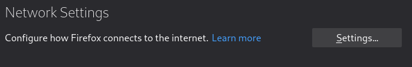
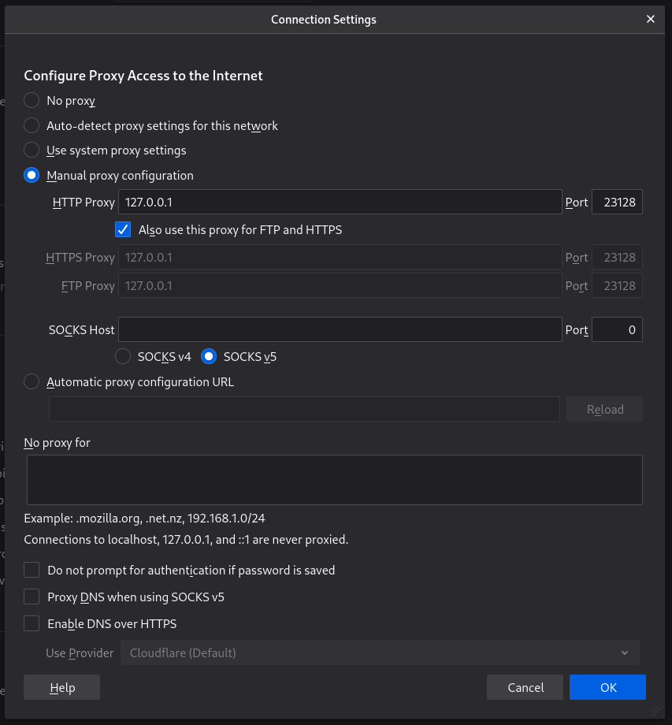

# Project: Blindeye

## Container config

Running `./launch.sh` will build the image and launch an ephemeral container.
The behaviour can be configured with the below shell environment variables.

| Variable            | Description                                     | Default                   |
|---------------------|-------------------------------------------------|---------------------------|
| `VPN_SERVER`        | VPN Host:Port to connect to                     | NULL                      |
| `VPN_DOMAIN`        | Active Directory domain to authenticate against | NULL                      |
| `VPN_USER`          | VPN username                                    | NULL                      |
| `VPN_PASS`          | VPN password (won't echo when asked)            | NULL                      |
| `VPN_SSH_KEY`       | SSH public key to use in authorized_keys        | `${HOME}/.ssh/id_rsa.pub` |
| `PROXY_PORT_OFFSET` | Offset ports by this value (eg. offset + 22)    | 20000                     |

## SSH Client Config

This assumes you leave `PROXY_PORT_OFFSET` as the default 20000.

### Proxy container host config

The below config is for connecting to the proxy container. We don't record
the HostKey because it's ephemeral.

```sshconfig
Host blindeye
  Hostname 127.0.0.1
  User null
  IdentityFile ~/.ssh/id_rsa
  Port 20022
  StrictHostKeyChecking no
  UserKnownHostsFile /dev/null
```

### Jumpbox host config

Below is an example of how you will connect to a jumpbox via the proxy
container, the important bit is the `ProxyCommand`.

```sshconfig
Host jumpbox
  Hostname jumpbox.some.domain
  User auser
  ProxyCommand ssh blindeye "nc %h %p"
```

## HTTP proxy

This assumes you leave `PROXY_PORT_OFFSET` as the default 20000.

### Firefox example

The below is how you would set up HTTP proxy in Firefox to connect to
resources on the other side of the VPN.

Go to [about:preferences](about:preferences) and scroll down to "Network
Settings". Click the "Settings" button.



Enter 127.0.0.1:23182 as the HTTP/HTTPS/FTP proxy.


